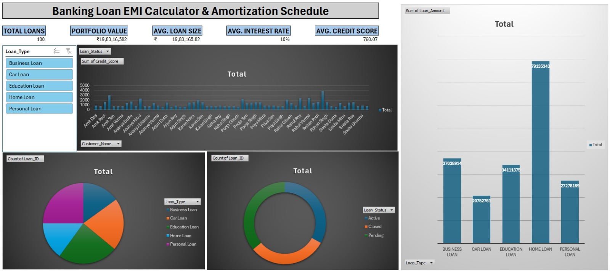

# loan-emi-calculation
# 💰 Banking Loan EMI Calculator & Amortization Dashboard

> 📊 An advanced Excel-based banking analytics project for EMI calculation, amortization scheduling, financial reporting, and interactive dashboard visualization.

## Overview

This project is an advanced Microsoft Excel–based **Loan EMI Calculator and Amortization Dashboard** designed for banking and financial analysis. It combines data cleaning, loan analytics, EMI calculation, amortization scheduling, pivot analysis, and dashboard visualization into a single interactive workbook.

The workbook is ideal for:

* Banking and finance students
* Data analytics projects
* Excel portfolio projects
* Financial reporting practice
* Loan repayment analysis

---

# 🚀 Project Features

## 📂 1. Raw Loan Dataset

* Contains 100+ loan records
* Includes customer and loan-related information such as:

  * Loan ID
  * Customer Name
  * Loan Amount
  * Interest Rate
  * Duration
  * Credit Score
  * Loan Status
  * EMI Start Date

---

## 🧹 2. Data Cleaning Tasks

Performed multiple Excel-based data cleaning operations including:

* Removing duplicates
* Handling blank values
* Standardizing formats
* Correcting data inconsistencies
* Using formulas and conditional logic
* Structuring data into analysis-ready format

---

## 🧮 3. EMI Calculator

Interactive EMI calculator using Excel financial formulas.

### Functionalities

* Enter Loan ID
* Automatically fetch loan details using `XLOOKUP`
* Calculate:

  * Monthly EMI
  * Total Payable Amount
  * Total Interest

### Excel Functions Used

* `PMT()`
* `XLOOKUP()`
* `IF()`
* `SUM()`

---

## 📅 4. Amortization Schedule

Dynamic amortization table that displays:

* EMI Number
* Monthly Payment
* Principal Paid
* Interest Paid
* Outstanding Balance

### Financial Functions Used

* `PMT()`
* `PPMT()`

---

## 📈 5. Pivot Tables & Analysis

Created multiple pivot tables for portfolio analysis:

* Loan Type Analysis
* Loan Status Distribution
* Credit Score Category Analysis
* Loan Type vs Loan Status Matrix
* Average Interest Rate & Loan Size Analysis

---

## 📊 6. Interactive Dashboard

Built an executive-level dashboard with:

* KPI Cards
* Portfolio Summary
* Average Loan Metrics
* Charts and Visualizations
* Dynamic summaries using Pivot Tables

### Dashboard KPIs

* Total Loans
* Portfolio Value
* Average Loan Size
* Average Interest Rate
* Average Credit Score

---

# 🗂️ Workbook Structure

| Sheet Name         | Description                         |
| ------------------ | ----------------------------------- |
| Content            | Workbook navigation and overview    |
| Raw Data           | Original loan dataset               |
| Cleaning Tasks     | Data cleaning checklist and process |
| Cleaned Data       | Final structured dataset            |
| EMI Calculation    | Interactive EMI calculator          |
| Amortization Table | Loan repayment schedule             |
| Pivot1–Pivot5      | Analytical pivot tables             |
| Dashboard          | Final visualization dashboard       |
| Instructions       | User guide and workflow             |

---

# 🛠️ Tools & Technologies Used

* 📗 Microsoft Excel
* 📊 Pivot Tables
* 📉 Pivot Charts
* 💹 Excel Financial Functions
* 🧹 Data Cleaning Techniques
* 🎨 Dashboard Design
* 🎯 Conditional Formatting
* 🔎 Lookup Functions
* Pivot Tables
* Pivot Charts
* Excel Financial Functions
* Data Cleaning Techniques
* Dashboard Design
* Conditional Formatting
* Lookup Functions

---

# 📚 Key Excel Concepts Demonstrated

* Financial Modeling
* EMI Calculation Logic
* Loan Amortization
* Data Cleaning Workflow
* Interactive Dashboarding
* Business Intelligence Reporting
* Excel Automation Using Formulas

---

# ▶️ How to Use

1. Open the workbook.
2. Navigate to the **EMI Calculation** sheet.
3. Enter a valid Loan ID.
4. Review automatically generated loan details.
5. Check EMI, total payable amount, and interest.
6. Open the **Amortization Table** sheet for repayment schedule.
7. Explore pivot tables and dashboard for insights.

---

# 🔍 Sample Insights Generated

* Which loan category has the highest portfolio value
* Average credit score distribution
* Active vs Closed loan comparison
* Interest rate trends across loan types
* Monthly repayment breakdowns

---

# 🎯 Learning Outcomes

This project demonstrates practical knowledge of:

* Banking analytics
* Loan repayment systems
* Excel financial formulas
* Dashboard creation
* Data analysis and visualization
* Business reporting techniques

---

# 🚀 Future Improvements

Possible enhancements:

* VBA automation
* Power Query integration
* Power BI dashboard version
* Dynamic slicers and filters
* Risk scoring model
* Predictive analytics for loan default

---

# 👨‍💻 Author

**Debtanu De**

Excel | Data Analytics | Banking Analytics | Dashboard Design

---

# 📜 License

This project is created for educational and portfolio purposes.

